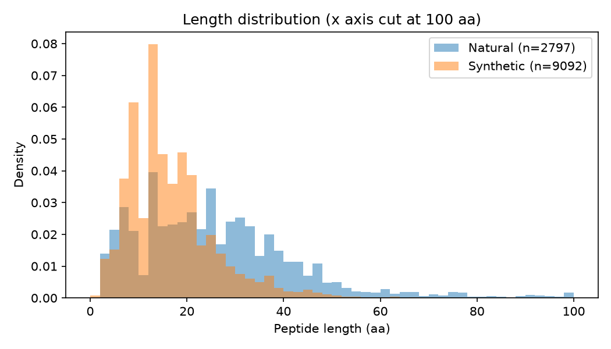
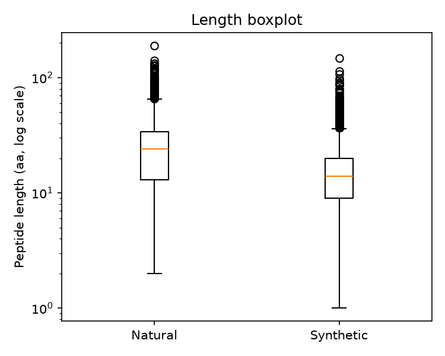
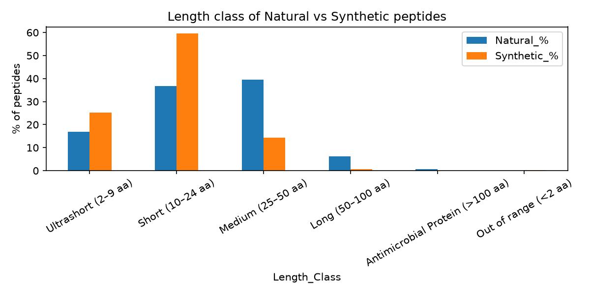
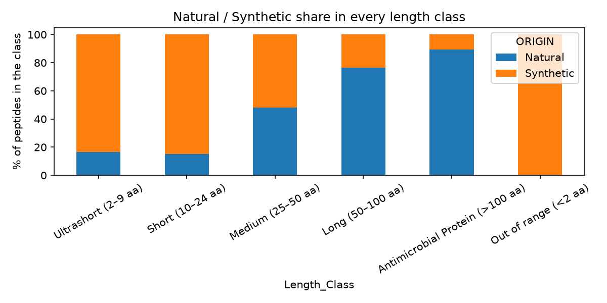
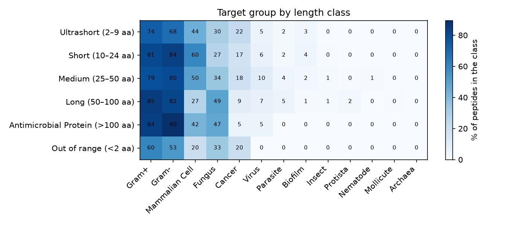
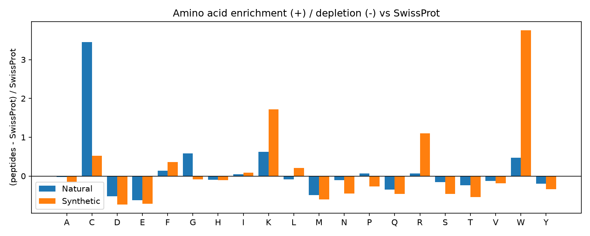

# DBAASP comparative study: Natural vs Synthetic antimicrobial peptides

This repository cleans the DBAASP peptide datasets, removes redundancy with CD-HIT (90 % identity), and then studies
two of the groupings with very simple statistics and an amino-acid enrichment analysis:

* **`by_origin`**: Natural vs Synthetic (the main focus)
* **`by_length_class`**: Ultrashort / Short / Medium / Long / >100 aa / <2 aa

Everything uses columns that already exist in the data. No new parameters were calculated.
All scripts are short, numbered, and can be read from top to bottom.

---

## 1. Folder map

```
raw_data/dbaasp_datasets_corrected.zip   original, untouched data
by_origin/ by_length_class/ by_domain/
by_kingdom/ by_target_group/ by_target_object/
                                         CLEANED csv files (overwritten in place, same file names)
manifest.csv                             row counts per dataset: raw -> clean -> non-redundant (nr90)

cdhit/<grouping>/<subgroup>/             CD-HIT work folder for EVERY dataset (6 groupings, 54 subgroups)
    input.fasta                          all cleaned sequences
    input_ge10aa.fasta                   sequences >= 10 aa (the ones sent to cd-hit)
    cdhit_ge10aa.fasta(.clstr)           cd-hit output and cluster file
    nr90.fasta                           final non-redundant FASTA
nonredundant_csv/<grouping>/<subgroup>.csv   the same non-redundant set as a table (used for the statistics)

fasta_files/by_origin/{Natural,Synthetic}/<subgroup>.fasta
fasta_files/by_length_class/<6 subgroups>/<subgroup>.fasta
                                         non-redundant FASTA files, input for Composition Profiler

analysis/origin/                         Natural vs Synthetic: tables (csv) + plots (png)
analysis/length_class/                   length class comparison: tables (csv) + plots (png)
composition_profiler/background/         SwissProt background FASTA
composition_profiler/results/            enrichment results (csv + png)
reports/cleaning_report.csv              rows removed at each cleaning step, for every file
reports/cdhit_summary.csv                rows before/after CD-HIT, for every file
scripts/                                 01 ... 06, run in this order
```

## 2. How to reproduce

```bash
pip install -r requirements.txt
sudo apt-get install cd-hit                       # or: conda install -c bioconda cd-hit
git clone https://github.com/vvacic/cprofiler
pip install -e cprofiler                          # -e is required, see section 7.1

python scripts/01_clean_datasets.py               # overwrites the csv files in by_*/ (the raw zip is kept)
python scripts/02_run_cdhit.py
python scripts/03_make_fasta_files.py
python scripts/04_analyze_origin.py
python scripts/05_analyze_length_class.py
python scripts/06_run_composition_profiler.py
```
Note: step 01 works on the files currently in `by_*/`. To start again from the raw data, unzip
`raw_data/dbaasp_datasets_corrected.zip` into the repository root first.

---

## 3. Cleaning (`scripts/01_clean_datasets.py`)

Applied to **every** csv, in this order (counts for all files are in `reports/cleaning_report.csv`):

| Step | What is removed | Why |
|---|---|---|
| 1 | exact duplicate rows | 2,000 identical rows existed in the origin/length files (same peptide entered twice) |
| 2 | multi-chain entries (sequence contains spaces, COMPLEXITY = Multimer / Multi-Peptide) | several chains are written in one cell, and their `Length_of_Sequence` wrongly counts the spaces (e.g. 51 instead of 47), so length can't be trusted |
| 3 | sequences with no real amino acid (only `X`) | not a usable sequence (e.g. single `X` entries such as homoserine lactones) |
| 4 | duplicate sequences, case-insensitive, first entry kept | the same peptide listed with different IDs/activities |

Other checks (nothing needed fixing): no missing sequences, every `Length_of_Sequence` equals the real sequence
length for the remaining rows, `ORIGIN` / `Length_Class` match the file they are in, IDs are unique, and the
length class labels agree with the length numbers.

Things to know about the data: **lowercase letters are D-amino acids** and **`X` is a non-standard residue**.
D-amino acids are kept in the csv `SEQUENCE` column but are upper-cased in the FASTA files (a D-Lys is counted as Lys).
`X` is kept in the data (Composition Profiler simply skips it).

| Dataset | raw | duplicate rows | multi-chain | all-X | duplicate sequences | **clean** |
|---|---|---|---|---|---|---|
| Natural | 4,493 | -406 | -97 | -27 | -391 | **3,572** |
| Synthetic | 21,049 | -1,594 | -538 | -321 | -3,462 | **15,134** |
| Ultrashort (2-9 aa) | 4,987 | -555 | -44 | -202 | -1,465 | **2,721** |
| Short (10-24 aa) | 15,282 | -1,157 | -148 | -72 | -2,196 | **11,709** |
| Medium (25-50 aa) | 4,583 | -271 | -230 | 0 | -293 | **3,789** |
| Long (50-100 aa) | 504 | -14 | -204 | 0 | -2 | **284** |
| >100 aa | 30 | 0 | -9 | 0 | 0 | **21** |
| <2 aa | 156 | -3 | 0 | -74 | -64 | **15** |

After cleaning, 167 sequences are still present in both Natural and Synthetic (93 after CD-HIT); they were left in.

## 4. Removing redundancy with CD-HIT (`scripts/02_run_cdhit.py`)

```
cd-hit -i input_ge10aa.fasta -o cdhit_ge10aa.fasta -c 0.9 -n 5 -d 0
```
* `-c 0.9` = cluster at >= 90 % identity, keep one representative (cd-hit keeps the longest) per cluster
* `-n 5` = word size that cd-hit requires for 90 % identity, `-d 0` = keep the full ID as FASTA header
* Run separately for every dataset, so each subgroup is non-redundant on its own (a peptide can still be similar to a
  peptide in another subgroup, e.g. a Natural peptide and its Synthetic analogue).
* **Special condition: peptides shorter than 10 aa are not sent to CD-HIT.** cd-hit refuses/ignores very short
  sequences (its own minimum is 10 aa; I tested that it does not reliably merge identical 5-9 aa sequences). It is also
  not needed: two *different* peptides of <= 9 aa cannot be >= 90 % identical (one mismatch in 9 residues = 88.9 %) and
  identical ones were already removed in step 1. They are added back into `nr90.fasta`.
  The only thing this misses is a short peptide that is a fragment of a longer one.

| Dataset | clean | not clustered (<10 aa) | sent to cd-hit | kept from cd-hit | **non-redundant** | removed |
|---|---|---|---|---|---|---|
| Natural | 3,572 | 473 | 3,099 | 2,324 | **2,797** | 775 |
| Synthetic | 15,134 | 2,316 | 12,818 | 6,776 | **9,092** | 6,042 |
| Ultrashort | 2,721 | 2,721 | 0 | 0 | **2,721** | 0 |
| Short | 11,709 | 0 | 11,709 | 6,563 | **6,563** | 5,146 |
| Medium | 3,789 | 0 | 3,789 | 2,243 | **2,243** | 1,546 |
| Long | 284 | 0 | 284 | 224 | **224** | 60 |
| >100 aa | 21 | 0 | 21 | 19 | **19** | 2 |
| <2 aa | 15 | 15 | 0 | 0 | **15** | 0 |

(All other groupings were processed the same way, see `reports/cdhit_summary.csv`.)
Synthetic peptides are much more redundant (40 % removed) than Natural ones (22 %): synthetic libraries probably contain many
single-residue-substitution analogues of the same parent peptide.

---

## 5. Natural vs Synthetic (non-redundant data, `scripts/04_analyze_origin.py`)

Natural n = 2,797, Synthetic n = 9,092. All p-values are in `analysis/origin/statistical_tests.csv`.
With thousands of peptides even tiny differences give tiny p-values, so **read the sizes of the differences, not the p-values**.

### 5.1 Length
| | Natural | Synthetic |
|---|---|---|
| mean / median | 26.0 / 24 aa | 16.3 / 14 aa |
| middle 50 % (Q1-Q3) | 13-34 aa | 9-20 aa |
| min / max | 2 / 190 | 1 / 148 |

 

* **Natural peptides are clearly longer** (median 24 vs 14 aa; Mann-Whitney p < 1e-180). 46 % of Natural but only 15 %
  of Synthetic peptides are >= 25 aa.
* The Synthetic histogram has sharp spikes (e.g. 13 aa: 733 peptides vs 456 at 11 aa). This probably reflects
  design/library habits (peptides made in convenient lengths); Natural lengths are smoother.
* Inside Natural, **Nonribosomal** peptides are tiny (median 6 aa, max 22) while **Ribosomal** ones have a median of 27 aa
  (`analysis/origin/synthesis_type_length.csv`). This explains the small end of the Natural histogram.

### 5.2 Outliers (boxplot rule: longer than Q3 + 1.5 x IQR)
| | fence | outliers | share |
|---|---|---|---|
| Natural | > 65.5 aa | 94 | 3.4 % |
| Synthetic | > 36.5 aa | 364 | 4.0 % |

(no peptide is an outlier on the short side). The full list is in `analysis/origin/length_outliers.csv`.
* Natural outliers are real large proteins: Histone H5 (190 aa), alpha-synuclein (140), eosinophil cationic protein (133), RNase 7 (128)...
* Synthetic "outliers" (> 36 aa) are often **fragments or recombinant copies of natural proteins**, e.g. "RNase 7 (1-107)",
  "Alpha-synuclein (1-95)", "Filaggrin-2 (2244-2391)": 86 of the 317 named Synthetic outliers have a residue range in the name.
  So a part of the "synthetic" data is really natural sequence made in the lab.

### 5.3 Length class


| Length class | Natural % | Synthetic % |
|---|---|---|
| Ultrashort (2-9) | 16.9 | 25.3 |
| Short (10-24) | 36.7 | **59.5** |
| Medium (25-50) | **39.6** | 14.4 |
| Long (50-100) | 6.2 | 0.7 |
| >100 aa | 0.6 | 0.0 |
| <2 aa | 0.0 | 0.2 |

Synthetic peptides are mostly Short (10-24 aa); Natural peptides are spread over Short and Medium and are the
main source of Long peptides (>50 aa).

### 5.4 Other existing columns (`analysis/origin/`)
| | Natural | Synthetic | Comment |
|---|---|---|---|
| C-terminus modified (mostly amidation `AMD`) | 22 % | **48 %** | clear difference |
| N-terminus modified (mostly acetylation `ACT`) | 8.7 % | 9.7 % | no real difference |
| contains a D-amino acid | 8.8 % | 9.7 % | no real difference |
| contains `X` | 15.6 % | 14.5 % | no real difference |
| Target: Gram- bacteria | 80 % | 79 % | same |
| Target: Gram+ bacteria | 84 % | 78 % | small |
| Target: **Fungus** | **52 %** | 23 % | Natural peptides are tested against fungi far more |
| Target: Mammalian cell (toxicity) | 48 % | 56 % | small |
| Target: Cancer | 23 % | 18 % | small |
| Target: Parasite | 5.0 % | 1.2 % | Natural higher (small numbers) |
| Target: Virus | 5.0 % | 6.8 % | small |
| Target object: Lipid bilayer (membrane) | 82 % | 80 % | same, both act mostly on membranes |

Kingdom is only informative for Natural (65 % Animalia, 17 % Bacteria, 10 % Plantae, 6 % Fungi); 99.9 % of Synthetic peptides are "Unclassified".
Note that the target columns can list several targets per peptide, so the percentages do not add up to 100.

**Take-home for Natural vs Synthetic:** the biggest differences are length (Natural longer), length class mix,
terminal amidation (Synthetic ~2x more), and the fungal target. The antibacterial focus and membrane target are the same.

---

## 6. Length classes (non-redundant data, `scripts/05_analyze_length_class.py`)

(The labels say "Medium 25-50" and "Long 50-100", but 50 aa sits in Medium: Long really is 51-100 aa.)

| Length class | n | median length | Natural % | Synthetic % | C-term modified % | N-term modified % | D-amino acid % | contains X % |
|---|---|---|---|---|---|---|---|---|
| Ultrashort (2-9) | 2,721 | 7 | 16.5 | 83.5 | 46.9 | 20.1 | 23.3 | 28.5 |
| Short (10-24) | 6,563 | 16 | 15.2 | 84.8 | 48.8 | 6.6 | 6.1 | 11.8 |
| Medium (25-50) | 2,243 | 32 | 48.0 | 52.0 | 18.5 | 4.9 | 1.4 | 5.6 |
| Long (51-100) | 224 | 63 | 76.3 | 23.7 | 7.6 | 3.6 | 0.0 | 4.0 |
| >100 aa | 19 | 119 | 89.5 | 10.5 | 10.5 | 10.5 | 0.0 | 21.1 |
| <2 aa | 15 | 1 | 0.0 | 100 | 66.7 | 20.0 | 0.0 | 0.0 |

 

**Similarities**
* Gram+ and Gram- bacteria are the main targets in every class (about 70-90 %).
* Most data lies in the Short class (10-24 aa, 6,563 peptides), see `analysis/length_class/length_histogram_all.png`.

**Differences / hidden patterns**
* **The longer the peptide, the more Natural it is**: 16 % -> 15 % -> 48 % -> 76 % -> 90 %. Short peptide space is
  mostly synthetic, long peptide space is mostly natural.
* **Chemical "decoration" fades with length**: C-terminal modification 47-49 % (<25 aa) -> 18 % -> 8 %; D-amino acids
  23 % (ultrashort) -> 6 % -> 1 % -> 0 %; `X` residues 28 % -> 12 % -> 6 % -> 4 %. Only short, easy-to-synthesise
  peptides are heavily modified.
* **Target shifts with length**: activity against fungi rises (27 % Short -> 49 % Long), while mammalian-cell (toxicity)
  testing falls (60 % Short -> 27 % Long) and cancer falls (22 % Ultrashort -> 5-9 % Long/>100).
* The `>100 aa` (19 peptides) and `<2 aa` (15) classes are very small: do not read much into their percentages.

---

## 7. Amino acid enrichment with Composition Profiler

### 7.1 How it was done
* Tool: the official Composition Profiler, https://github.com/vvacic/cprofiler (version 2.0).
* Query 1: `fasta_files/by_origin/Natural/Natural.fasta` (2,797 non-redundant peptides).
* Query 2: `fasta_files/by_origin/Synthetic/Synthetic.fasta` (9,092 non-redundant peptides).
* Background (same for both): `composition_profiler/background/swissprot51_5k.fasta` (5,002 proteins).
* Length classes were **not** profiled (as requested).
* Settings: defaults of the tool, 10,000 iterations, alpha = 0.05, **plus Bonferroni correction** (`-b`, i.e. alpha = 0.05 / 40 tests = 0.00125,
  because 20 amino acids + 20 amino acid groups are tested at once). Random seed fixed (`np.random.seed(1)`), because the p-values come from random sampling.
* Equivalent command line: `cprof discover -Q <query.fasta> -B <background.fasta> -I 10000 -A 0.05 -b`, and for the pictures
  `cprof plot -Q <query.fasta> -B <background.fasta> -X alpha -O <png>`.

**Two deviations from the instructions, and why**
1. The command `python cprofiler_cli.py --query ... --background ... --output ...` does not exist in the official repository.
   The real command is `cprof discover` / `cprof plot`, but `cprof discover` only prints a (cut-off) table on screen. So
   `scripts/06_run_composition_profiler.py` calls the *same* official functions (`CompositionProfiler.discover` etc.) and saves a real csv.
   The official `cprof plot` figure shows the same numbers as the csv (checked).
2. `pip install cprofiler` (non-editable) crashes, because the package does not ship its `data` folder. Use `pip install -e cprofiler` (as in section 2).

### 7.2 How the background was chosen, and why
* **Background = 5,002 proteins randomly sampled from SwissProt (release 51), the SwissProt file that ships with the official tool
  (`cprofiler/data/sprot51_5k.fa`, i.e. `-D sprot`).** It was copied into the repository so it is visible.
* Reasons:
  1. SwissProt is the manually reviewed part of UniProt, the standard reference for "what a typical protein looks like".
     Enrichment against it answers: *"how is the composition of DBAASP peptides different from normal proteins?"*
  2. A random sample of the whole database has no bias towards any organism or protein family.
  3. **The same background for Natural and for Synthetic**, so the two results can be compared directly.
  4. It was requested (SwissProt), and it is the default of the tool.
* Limits (be aware of these):
  * It is an **old release (2006) and only a ~5,000-protein sample**, not the current full SwissProt. I could not download the current
    release because `uniprot.org` / `ebi.ac.uk` are blocked in the environment where this was run. Amino acid composition of proteins hardly changes between releases,
    so I expect only small effects, but it is a limitation. To redo it with a current file:
    download `uniprot_sprot.fasta.gz`, unzip it, put it in `composition_profiler/background/` and change `BACKGROUND` in `scripts/06_run_composition_profiler.py`.
  * SwissProt proteins are **long (mean ~360 aa in this file) and mostly folded**; the queries are **short peptides**. So "enriched" means "different from a typical protein",
    not "different from a random peptide".

### 7.3 Results
Effect = (frequency in peptides - frequency in SwissProt) / frequency in SwissProt.
+0.50 means 50 % more frequent than in SwissProt (x1.5), -0.50 means half as frequent, +3.45 means x4.45.
Result = Enriched / Depleted / Not significant after Bonferroni. Full tables: `composition_profiler/results/`.



**Single amino acids**

| Amino acid | Natural effect | Natural result | Synthetic effect | Synthetic result |
|---|---|---|---|---|
| A | -0.03 | Not significant | -0.15 | Depleted |
| C | **+3.45** | Enriched | +0.52 | Enriched |
| D | -0.52 | Depleted | -0.73 | Depleted |
| E | -0.62 | Depleted | -0.72 | Depleted |
| F | +0.14 | Enriched | +0.36 | Enriched |
| G | +0.58 | Enriched | -0.09 | Depleted |
| H | -0.09 | Depleted | -0.10 | Depleted |
| I | +0.04 | Not significant | +0.09 | Enriched |
| K | +0.62 | Enriched | **+1.72** | Enriched |
| L | -0.08 | Depleted | +0.21 | Enriched |
| M | -0.49 | Depleted | -0.60 | Depleted |
| N | -0.11 | Depleted | -0.45 | Depleted |
| P | +0.07 | Enriched | -0.26 | Depleted |
| Q | -0.35 | Depleted | -0.47 | Depleted |
| R | +0.06 | Enriched | **+1.11** | Enriched |
| S | -0.16 | Depleted | -0.46 | Depleted |
| T | -0.24 | Depleted | -0.54 | Depleted |
| V | -0.13 | Depleted | -0.18 | Depleted |
| W | +0.47 | Enriched | **+3.76** | Enriched |
| Y | -0.20 | Depleted | -0.34 | Depleted |

**Amino acid groups (selection)**

| Group | Natural effect | Natural result | Synthetic effect | Synthetic result |
|---|---|---|---|---|
| Positively charged | +0.35 | Enriched | +1.42 | Enriched |
| Negatively charged | -0.58 | Depleted | -0.73 | Depleted |
| Charged (all) | -0.12 | Depleted | +0.32 | Enriched |
| Aromatic | +0.06 | Enriched | +0.57 | Enriched |
| Hydrophobic (Kyte-Doolittle) | +0.03 | Enriched | 0.00 | Not significant |
| Hydrophobic (Eisenberg) | +0.08 | Enriched | +0.02 | Enriched |
| Hydrophobic (Fauchere-Pliska) | -0.14 | Depleted | -0.09 | Depleted |
| Flexible (Vihinen) | +0.06 | Enriched | +0.20 | Enriched |
| Frequent in coils (Nagano) | -0.12 | Depleted | +0.28 | Enriched |
| Order promoting (Dunker) | +0.09 | Enriched | -0.18 | Depleted |

(all 40 rows for both datasets: `composition_profiler/results/natural_vs_synthetic_side_by_side.csv`)

### 7.4 Interpretation of these results
* **Both groups look like antimicrobial peptides:** more of the positively charged K (and R), more W, and almost no D, E, M, Q, T, Y.
  The positively-charged group is enriched and the negatively-charged group is depleted in both (x1.4 / x0.4 in Natural, x2.4 / x0.3 in Synthetic).
  This fits how antimicrobial peptides work: a positive charge is attracted to the negative bacterial membrane, and aromatic/hydrophobic residues insert into it.
* **Synthetic peptides are "over-designed" toward this recipe.** Trp is x4.8, Lys x2.7, Arg x2.1 the SwissProt frequency, and the
  positively-charged group is x2.4. Natural peptides go in the same direction but much more gently (K x1.6, W x1.5, R ~ unchanged).
  This is what one expects from rational design: people push charge and Trp/Arg/Lys up.
* **Natural peptides have a special feature: Cysteine.** Cys is x4.4 in Natural but only x1.5 in Synthetic. Natural
  peptides (defensins and similar) are held in shape by disulfide bonds; synthetic peptides are mostly linear.
  Natural also has more **Gly** (+0.58 vs -0.09) and roughly normal Pro (+0.07 vs -0.26 in Synthetic).
* **Charge balance differs:** in Natural the "all charged" group is slightly *depleted* (-0.12, because lots of Asp/Glu balance the Lys/Arg), while in Synthetic it is *enriched* (+0.32), because the negative residues were designed out.
* **Structure-type groups:** Synthetic peptides are enriched in residues frequent in beta-sheets/coils and depleted in order-promoting residues; Natural peptides are the opposite (order-promoting enriched, coil residues depleted).
  These effects are moderate (0.1-0.3) and are a consequence of the charge/Trp/Cys differences above, not independent findings.
* **Hydrophobicity is not clearly different from SwissProt**: the three hydrophobicity scales disagree (one slightly positive, one ~0, one negative)
  and all effects are small (< 0.15). Hydrophobic character of these peptides comes from specific residues (W, F, C, and L in Synthetic), not from a general shift.

### 7.5 How to interpret the results yourself (what to look for)
1. **Open** `composition_profiler/results/<Natural or Synthetic>_vs_swissprot.csv`. Columns: `test_name` (amino acid or group), `effect`, `pvalue`, `test_result`.
2. **Read the sign first.** Positive = more frequent than in SwissProt, negative = less frequent. Turn it into a ratio with `1 + effect` (effect -0.6 -> x0.4).
3. **Then read the size.** With thousands of peptides almost every row is "significant", so significance says little.
   Rule of thumb used in this README (my choice, not from the tool): |effect| below 0.1 = negligible, 0.1-0.5 = moderate, above 0.5 = strong.
4. **Read the p-value correctly.** The tool shuffles whole sequences between the query and the background 10,000 times, so the smallest possible p-value is 1/10,000
   (shown as 0.0000, meaning < 0.0001). "Not significant" here means p > 0.00125 (Bonferroni corrected).
5. **Look at groups and residues together.** A group effect is only trustworthy if it agrees across scales
   (e.g. the "positively charged" group is consistent; the three hydrophobicity scales are not, so hydrophobicity is not a robust finding).
   Group rows are sums of residues that are also listed separately, so they are not independent evidence.
6. **Compare the two datasets side by side** (`natural_vs_synthetic_side_by_side.csv`): same sign and similar size = shared feature of antimicrobial peptides;
   different size = stronger design in one dataset; **opposite sign = real difference** (e.g. Gly, Pro, Leu, "charged").
7. **In the bar plots** the bars are the effect and the small error bar is the bootstrap uncertainty; a bar whose error bar touches zero is not reliable.
8. **Sanity-check against biology.** For antimicrobial peptides we expect more K/R (cationic), more W/F/L (membrane insertion), fewer D/E (anionic).
   If a result contradicted this, first suspect the data or the background, not new biology.
9. **Remember what the background is.** Everything is "compared with normal, long proteins from SwissProt". A large effect for a residue that peptides simply
   need (e.g. K/R) tells you about peptides in general, not about Natural vs Synthetic. Only differences *between* the two profiles say something about origin.

---

## 8. Limitations (short list)
* SwissProt background is an old (release 51) ~5,000-protein sample (see 7.2).
* Multi-chain peptides (Multimer / Multi-Peptide, 675 raw rows in the origin/length data) were removed; results are for single-chain peptides only.
* D-amino acids are treated as the same residue as their L-form in the FASTA files / enrichment.
* Peptides < 10 aa were not clustered by cd-hit; redundancy between different subgroups (e.g. a synthetic analogue of a natural peptide) was not removed. 93 identical sequences are in both Natural and Synthetic.
* The Natural and Synthetic groups differ in length, and the enrichment analysis was not adjusted for that.
* Statistics are deliberately simple (medians, percentages, chi-square, Mann-Whitney, boxplot outlier rule); they show associations, not causes.
