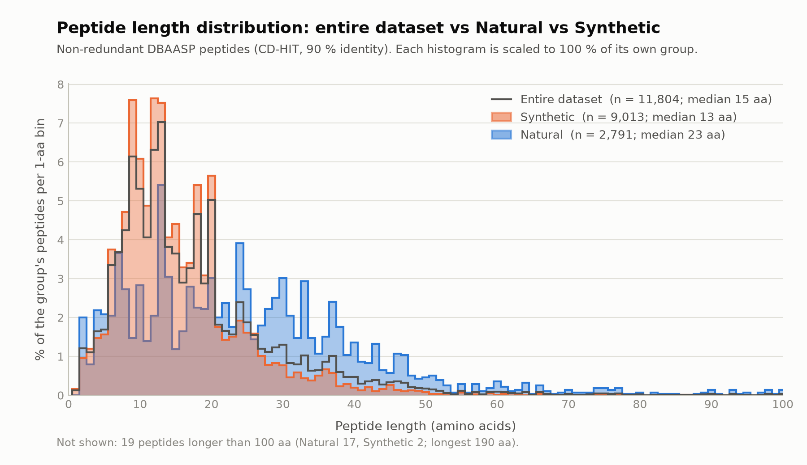
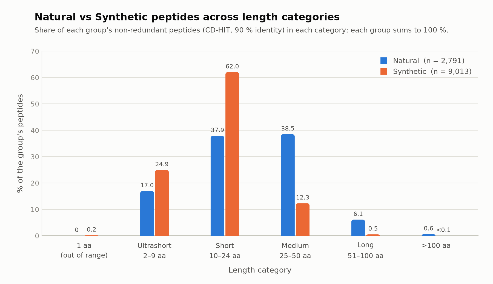

# Deliverables: non-redundant DBAASP peptides (Natural + Synthetic)

One non-redundant FASTA of all Natural and Synthetic peptides, the exact count of sequences lost on the way, and the
length figures. Everything here is rebuilt from `../raw_data/dbaasp_datasets_corrected.zip` by the three scripts in
`scripts/`. Nothing outside this folder is read or changed except that zip.

```
deliverables/
  fasta/amp_nonredundant.fasta            11,804 peptides, ">DBAASP_<ID>" + one-line upper-case sequence
  figures/length_histogram_overlap.png         overlapping histograms: entire / Natural / Synthetic (each as % of its group)
  figures/length_histogram_overlap_counts.png  the same with peptide counts
  figures/length_category_fraction_bar.png     share of Natural and Synthetic peptides per length category
  tables/redundancy_removal_summary.csv   step-by-step counts, Natural / Synthetic / Total
  tables/removed_records.csv              every lost record: why, and which kept peptide covers it (+ identity for CD-HIT)
  tables/peptide_metadata.csv             FASTA ID -> origin, length, length category, sequence
  tables/length_summary.csv               numbers behind the histogram
  tables/length_category_fractions.csv    numbers behind the bar chart
  tables/cdhit_checks.csv                 integrity checks and two what-if runs (section 4)
  cdhit/                                  CD-HIT input, output, cluster file (.clstr) and log
  scripts/01_remove_redundancy.py  02_make_figures.py  03_check_cdhit_result.py
```

## 1. Sequences lost

**CD-HIT (>= 90 % identity) removed 6,735 sequences** (781 Natural, 5,954 Synthetic) of the 15,803 it was given (42.6 %).
Counted from the raw DBAASP export, **13,738 of 25,542 rows are lost, 11,804 remain.**

| Step | what is removed | Natural | Synthetic | **Total lost** | left |
|---|---|---|---|---|---|
| 0 | raw rows | | | | 25,542 |
| 1 | exact duplicate row (same entry, same ID, twice) | 406 | 1,594 | 2,000 | 23,542 |
| 2 | multi-chain entry (several chains in one cell, length not reliable) | 97 | 538 | 635 | 22,907 |
| 3 | sequence made only of `X` | 27 | 321 | 348 | 22,559 |
| 4 | duplicate sequence within the same origin | 391 | 3,462 | 3,853 | 18,706 |
| 5 | same sequence in Natural and in Synthetic (Natural entry kept) | 0 | 167 | 167 | 18,539 |
| 6 | **CD-HIT, >= 90 % identity** | **781** | **5,954** | **6,735** | **11,804** |
| | **final** | **2,791** | **9,013** | | |

Steps 1 to 4 are the existing cleaning of `scripts/01_clean_datasets.py`; they reproduce the repository's cleaned
files ID for ID. Step 1 removes repeated rows of the same entry, so it is not a loss of distinct peptides: of the
23,542 distinct entries, 11,738 are lost.

CD-HIT arithmetic: 18,539 peptides enter step 6. 2,736 of them are shorter than 10 aa and skip CD-HIT (section 3).
The other 15,803 go in, 9,068 representatives come out, 6,735 are removed. 9,068 + 2,736 = 11,804.

## 2. Figures




| | Natural | Synthetic | Entire |
|---|---|---|---|
| n | 2,791 | 9,013 | 11,804 |
| median / mean length (aa) | 23 / 25.6 | 13 / 15.6 | 15 / 17.9 |
| Q1 to Q3 | 13 to 34 | 9 to 20 | 10 to 22 |

| Share of group in category | Natural | Synthetic |
|---|---|---|
| 1 aa (out of range) | 0 % | 0.2 % |
| Ultrashort 2-9 aa | 17.0 % | 24.9 % |
| Short 10-24 aa | 37.9 % | **62.0 %** |
| Medium 25-50 aa | **38.5 %** | 12.3 % |
| Long 51-100 aa | 6.1 % | 0.5 % |
| > 100 aa | 0.6 % | 0.02 % |

Natural peptides are longer (median 23 vs 13 aa) and make up most of the Long (170 of 217) and > 100 aa (17 of 19)
peptides. Synthetic peptides sit mostly in the Short class. The Synthetic histogram has sharp spikes (e.g. 509 peptides at
20 aa but 278 at 19 aa; also 12-13 and 18 aa), probably convenient design lengths.

## 3. Method

```
cd-hit -i input_ge10aa.fasta -o cdhit_ge10aa.fasta -c 0.9 -n 5 -d 0 -l 9 -M 0 -T 1
```
* `-c 0.9 -n 5`: 90 % identity, word size 5, as in the rest of the repository. cd-hit keeps the longest peptide of each cluster.
* **Natural and Synthetic are clustered together**, so the single FASTA is non-redundant as a whole. When the same sequence
  is in both groups, the Natural entry is kept.
* **Peptides shorter than 10 aa are not sent to CD-HIT**, the existing rule of `scripts/02_run_cdhit.py`.
* **`-l 9` matters.** cd-hit's default `-l 10` silently discards every sequence of 10 aa or fewer. The script checks that
  cd-hit read exactly as many sequences as it was sent (15,803), and stops if not.
* `-T 1`: one thread, so the result is reproducible. The output is byte-identical on re-run.
* FASTA headers use the DBAASP ID (`>DBAASP_11`), not a running number, so every entry can be traced back to the database.
  Sequences are upper case (D-amino acids are lower case in the csv files); `X` (non-standard residue) is kept.
  Origin is not in the header: use `tables/peptide_metadata.csv`.

## 4. Things to know

1. **The earlier CD-HIT step undercounts 10-aa peptides.** `scripts/02_run_cdhit.py` sent peptides >= 10 aa to cd-hit with the
   default `-l 10`, which discards 10-aa sequences. `cdhit/by_origin/*/cdhit.log` shows it: Natural "total seq: 3012" although 3,099
   were sent, Synthetic 12,029 of 12,818. So 87 + 789 = 876 ten-aa peptides were dropped and counted as "removed by CD-HIT"
   (section 4 of the main README: 775 / 6,042 removed, 2,797 / 9,092 kept). Clustered per origin with the fix, the result would be
   2,881 / 9,665. These deliverables do not have the problem. The existing scripts, tables and analyses were left as they were.
2. **Combined vs separate clustering.** Clustering together removed 1,701 Synthetic peptides because a Natural peptide covers
   them, and 132 Natural ones because a Synthetic peptide does. Clustering each origin on its own (the old way) would keep
   12,546 peptides (2,881 / 9,665) but the FASTA would still hold Natural/Synthetic near-duplicates. The medians hardly change
   (Natural 23 either way; Synthetic 14 vs 13), so the length conclusions do not depend on this choice.
3. **CD-HIT is greedy**, so which peptide is kept depends a little on the input order (in a test with a different input order the
   separate-clustering numbers moved by 3 and 6 peptides). The deliverable numbers are for the input order of script 01 and are reproducible.
4. **Peptides of 5-9 aa are not clustered.** Two different peptides of up to 9 aa cannot be 90 % identical, but a short peptide
   can be an exact fragment of a longer one. If the 5-9 aa peptides are clustered too (cd-hit cannot read anything under 5 aa),
   **492 more are removed** (478 Synthetic, 14 Natural), leaving 11,312. The final FASTA has 2,255 peptides of 5-9 aa,
   466 of 2-4 aa and 15 of 1 aa.
5. **15 single-amino-acid entries** (all Synthetic, class "out of range") are kept, as in the existing cleaning. Remove them for a
   strict peptide set (11,789).
6. **Length categories** follow the `Length_Class` column of the data (all 11,804 agree). The data labels the class "Long (50-100 aa)", but
   50-aa peptides are in Medium; Long is 51-100 aa and is labelled so here.
7. **The histogram axis stops at 100 aa**; the 19 longer peptides (17 Natural, 2 Synthetic, longest 190 aa) are named in the
   figure footnote and are in the tables. The overlapping histograms are scaled to 100 % of their own group, because Natural
   (2,791) is much smaller than Synthetic (9,013); the counts version is `length_histogram_overlap_counts.png`.

## 5. Reproduce

```bash
pip install pandas matplotlib numpy
sudo apt-get install cd-hit                 # or: conda install -c bioconda cd-hit   (tested with 4.8.1)
python deliverables/scripts/01_remove_redundancy.py
python deliverables/scripts/02_make_figures.py
python deliverables/scripts/03_check_cdhit_result.py      # optional: checks and what-ifs
```
`tables/removed_records.csv` columns: `STEP` (as in the table above), `COVERED_BY` (kept peptide with the same or a >= 90 % identical
sequence, for steps 1, 4, 5 and 6), `IDENTITY_%` (CD-HIT only).
